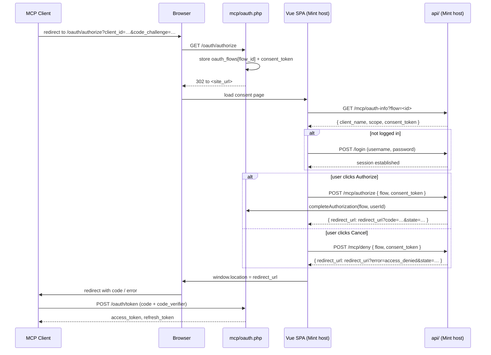

# Mint MCP

Mint MCP is a module in Mint that acts as an MCP server and enables integration with MCP clients such as Visual Studio Code, Copilot Chat, etc. Thanks to this, you can use MCP tools in Mint and add your own.

## Authentication Flow

Mint MCP implements OAuth 2.1 with PKCE. The user-facing consent page is rendered by the Vue SPA (not by `mcp/`) so the experience matches the rest of Mint. The PHP shared session is used as coordination state between the MCP host and the Mint/Vue host.

Key pieces:

- `mcp/oauth.php` — entry point for `/oauth/authorize`, `/oauth/token`, etc. Only the first redirect hits it; after that everything happens on the Mint host.
- `OAuth2Server::redirectToLogin()` — stores the pending request under `$_SESSION['oauth_flows'][<flow_id>]` with a 15-minute `expires_at` and a random `consent_token`, then redirects the browser to `<site_url>#/mcp/login?flow=<flow_id>`. Using `site_url` (not `HTTP_HOST`) is what lets MCP live on a separate domain.
- `McpLoginView.vue` — reads `flow` from the URL, fetches `GET /mcp/oauth-info?flow=…` to populate client name and scopes, and shows explicit **[Authorize]** / **[Cancel]** buttons. No auto-authorization.
- `McpController::authorize()` / `McpController::deny()` — validate `flow_id` + `consent_token` (CSRF protection, `hash_equals`), enforce the TTL, and return the final `redirect_url` back to the MCP client.

### Sequence



### Security properties

- `consent_token` is a 32-byte random string compared with `hash_equals`. Attacker JS on a third-party origin cannot read it — it is never placed in a URL, only in the JSON body returned from `/mcp/oauth-info` and in the POST body to `/mcp/authorize`/`/mcp/deny`. `/mcp/oauth-info` is served with `Cache-Control: no-store`.
- Flows live for 15 minutes (`OAuth2Server::FLOW_TTL_SECONDS`). Expired flows are garbage-collected on the next `redirectToLogin()` call.
- Concurrent flows do not collide: each authorization gets its own random `flow_id` and its own slot in `$_SESSION['oauth_flows']`.
- `Cancel` routes through `McpController::deny()` which re-validates the redirect_uri against the registered client, so it cannot be turned into an open redirect even if the session were tampered with.

## Server Configuration

MintHCM MCP is served at `<site_url>/mcp` (e.g. `https://your-mint-domain/mcp`). Apache must have `mod_rewrite` loaded and `AllowOverride All` (or at minimum `AllowOverride FileInfo`) on the directory containing `mcp/`.

**Installation requirement**: the root `.htaccess` is generated from the template `legacy/MintCLI/src/Assets/.htaccess` during installation — both by MintCLI and by the browser-based installer. If for any reason the file is missing or outdated, re-run the installation's htaccess step or manually copy the template, replace `__BASE_PATH__` with the installation path (e.g. `/MintHCM` or `/`), and place the result at the MintHCM root.

### Discovery endpoints

OAuth 2.1 clients discover the authorization server by fetching metadata under `.well-known/`. Different clients use different conventions:

| URL pattern | Spec | Handler |
|---|---|---|
| `<site_url>/mcp/.well-known/oauth-protected-resource` | RFC 9728 path-appending | `mcp/.htaccess` |
| `<site_url>/mcp/.well-known/oauth-authorization-server` | RFC 8414 path-appending | `mcp/.htaccess` |
| `<site_url>/mcp/.well-known/openid-configuration` | OIDC-style path-appending | `mcp/.htaccess` |
| `<host>/.well-known/oauth-authorization-server/mcp` | RFC 8414 path-insertion (single instance at DocumentRoot) | root `.htaccess` (MintCLI) |
| `<host>/.well-known/oauth-protected-resource/mcp` | RFC 9728 path-insertion (single instance at DocumentRoot) | root `.htaccess` (MintCLI) |
| `<host>/.well-known/openid-configuration/mcp` | OIDC path-insertion (single instance at DocumentRoot) | root `.htaccess` (MintCLI) |

Path-insertion URLs land outside the `mcp/` directory — `mcp/.htaccess` cannot reach them. They are handled by the root `.htaccess` generated by MintCLI. **This rule only matches when a MintHCM installation occupies the entire DocumentRoot** (no `<path>` segment between `.well-known/...` and `mcp`) — see below for hosts running several instances under one DocumentRoot.

### Multi-instance hosting (shared DocumentRoot)

Some environments run several MintHCM installations as subdirectories of one Apache DocumentRoot, e.g.:

```
/var/www/              ← DocumentRoot
├── aiagent/           ← MintHCM instance #1
├── develop/           ← MintHCM instance #2
└── MintHCM/           ← MintHCM instance #3
```

A path-insertion discovery request for instance `aiagent` looks like `<host>/.well-known/oauth-authorization-server/aiagent/mcp` — the `.well-known/` segment is resolved directly under the **shared** DocumentRoot, so it never reaches any instance's own `.htaccess` (Apache resolves `.htaccess` files by walking the filesystem path of the request, and `aiagent` here is not a path prefix — it comes *after* `.well-known/...`). No `.htaccess` inside `aiagent/` can intercept this request.

This requires a **one-time, manual** addition to the `.htaccess` in the shared DocumentRoot itself (`/var/www/.htaccess` in the example above — not any instance's own `.htaccess`, and not tracked in any single instance's repository):

```apache
RewriteEngine On
RewriteRule ^\.well-known/oauth-protected-resource/(.+)/mcp/?$   $1/mcp/oauth.php [L,QSA,E=OAUTH_ENDPOINT:discovery]
RewriteRule ^\.well-known/oauth-authorization-server/(.+)/mcp/?$ $1/mcp/oauth.php [L,QSA,E=OAUTH_ENDPOINT:authorization]
RewriteRule ^\.well-known/openid-configuration/(.+)/mcp/?$       $1/mcp/oauth.php [L,QSA,E=OAUTH_ENDPOINT:authorization]
```

The `(.+)` capture group matches the instance's subdirectory (`aiagent`, `develop`, ...) and forwards the request into that instance's own `mcp/oauth.php`. Adding a new instance under a new subdirectory requires no further Apache changes — the rule is generic. This block is independent of, and does not replace, the per-instance `.htaccess` generated by MintCLI.

## MCP Client Configuration

The following example describes configuration for the MCP client in Visual Studio Code; it should be similar for other clients.

### Adding MCP Server in Visual Studio Code
1. Run command `MCP: Add Server...` in Visual Studio Code.
2. Choose HTTP as the server type.
3. Enter the URL of your Mint MCP server, e.g., `https://your-mint-domain/mcp`.
4. Enter a name for the server, e.g., `my-mcp-server-mint1`.
Your configuration should look like this in your `mcp.json` file:

```json
{
    "servers": {
        "my-mcp-server-mint1": {
            "type": "http",
            "url": "https://your-mint-domain/mcp"
        }
    }
}
```

### Using the MCP Server in Visual Studio Code
1. Run the command `MCP: List Servers` and select your server `my-mcp-server-mint1`.
2. Select `Start server`. If this is your first time using Mint MCP via this client, you will be asked to log in to your MintHCM. After a successful login wait for the message `Connection state: Running` and then `Discovered X tools`.
3. Open Copilot Chat, set the mode to `Agent`, and select `"Configure tools..."` (the tools icon under the chat input field).
4. Make sure that in the `my-mcp-server-mint1` section, the tools you want to use are checked.

After completing these steps, your MCP client should be properly configured and ready to use.

### Adding MCP Server in Claude Code CLI

1. Register the server:
   ```bash
   claude mcp add --transport http mint-mcp https://your-mint-domain/mcp/
   ```
2. Start Claude Code:
   ```bash
   claude
   ```
3. On first connection Claude Code will open a browser tab with the Mint login and consent screen. Log in and click **Authorize**.
4. After authorization, verify the connection:
   ```
   /mcp
   ```
   You should see `mint-mcp` with status `connected` and the list of discovered tools.

To remove the server: `claude mcp remove mint-mcp`

---

### Claude Code CLI inside a local Docker container

When Claude Code CLI runs **inside** the same Docker container as MintHCM (typical local dev setup), a few things differ from a remote deployment.

**MCP URL to use**

Inside the container Apache listens on port 80 — use the internal URL, not the Windows-side mapped port:

```
http://localhost/mint/mcp/
```

**site_url mismatch**

MintHCM's `site_url` in `legacy/config.php` is typically set to the Windows-side URL (e.g. `http://localhost:8085/mint`). The OAuth discovery documents return that URL in `authorization_endpoint`, `token_endpoint`, etc. From inside the container port `8085` is unreachable — token exchange fails.

Two options:
- **Run Claude Code on Windows** (recommended) — use `http://localhost:8085/mint/mcp` where all OAuth endpoints are reachable.
- **Change `site_url`** to `http://localhost/mint` in `legacy/config_override.php` — discovery returns internal URLs, OAuth works inside the container, but browser redirects during login also use `localhost` (reachable from Windows via the same port-mapping).

**Steps**

1. Register and start the server:
   ```bash
   claude mcp add --transport http mint-mcp http://localhost/mint/mcp/
   claude
   ```
2. Claude Code prints an OAuth authorization URL — open it in the browser on Windows, log in to Mint and click 
**Authorize**.
    *  If you changed `site_url` to `http://localhost/mint`, the browser will redirect to `http://localhost/mint/mcp/oauth/callback?code=…&state=…`. Change `localhost` to `localhost:8085` (use your port) in the URL and hit Enter to reach the MintHCM host on Windows. The callback will complete the OAuth flow.
3. Verify the connection: type `/mcp` in Claude Code — `mint-mcp` should show status `connected`.

**Troubleshooting — `POST /mcp` returns 301 then GET returns 405/404**

Check added url to claude mcp add command. It should be the same as the one in the `mcp.json` file. If you added ` http://localhost/mint/mcp` without the trailing slash, the client will POST to `http://localhost/mint/mcp` (no slash) which Apache redirects to `http://localhost/mint/mcp/` (with slash). The client then GETs the new URL, which is not a valid endpoint and returns 405 or 404. Always add the trailing slash when adding the server URL to the client, correct example: `http://localhost/mint/mcp/`
```

**Troubleshooting — discovery returns `localhost:8085` URLs but client can't reach them**

The `site_url` mismatch described above. Either switch to running Claude Code on Windows or change `site_url`.

---

### Troubleshooting

Start with `mcp/mintmcp.log` — it records key OAuth lifecycle events (client registered, token issued, error responses) without any secrets. Then compare with Apache's `access.log` to see URLs the client hit *before* reaching PHP.

**"Dynamic Client Registration not supported" popup, or `SDK auth failed: HTTP 404` with HTML body in the error message**
The client requested a `.well-known/...` URL that Apache served 404 HTML for, and the client tried to parse it as JSON.
1. Check `AllowOverride All` (or `FileInfo`) is set for the `mcp/` directory in Apache's vhost config — without it, `.htaccess` is ignored entirely.
2. Fire a curl at the discovery URL — e.g. `curl -i https://your-mint-domain/mcp/.well-known/oauth-authorization-server`. Expect `200 OK` with JSON; `404` means the rewrite rule isn't matching.

**Connection stuck at "Waiting for server to respond to `initialize` request..."**
The client is waiting for you to complete the browser login. If no browser tab opened, clear the client's cached auth state:
- **VS Code**: Command Palette → MCP: List Servers → *your server* → Sign Out (if available).
- **Claude Code CLI**: `claude mcp remove <server-name>` and re-add it.
- **Any client**: close it, remove the stored credential entry (Windows Credential Manager / macOS Keychain / `~/.claude.json`), restart.

**`POST /register` returns 404 in Apache access log (without `/mcp/oauth/register`)**
The client is using hard-coded RFC 7591 defaults because it couldn't read `registration_endpoint` from the authorization server metadata — which means discovery failed earlier. Same fix as the "Dynamic Client Registration not supported" case above.

**Nothing shows up in `mintmcp.log` after connecting**
The request isn't reaching PHP. Check Apache `access.log` to see what URL the client hit and what status it got. If the URL is correct but returns 404, `AllowOverride` is likely too restrictive in vhost config.

## MCP Client Compatibility

Different MCP clients implement different subsets of the OAuth 2.1 and discovery specs. Below is what was tested, what the root cause of each quirk is, and what was done to address it.

### VS Code Extension (GitHub Copilot)

**Status: ✅ Supported**

VS Code uses path-appending discovery exclusively: it queries `<mcp-url>/.well-known/oauth-protected-resource`, then falls back to `<mcp-url>/.well-known/oauth-authorization-server` and `<mcp-url>/.well-known/openid-configuration`. All three are handled by `mcp/.htaccess` and require no root `.htaccess` rules.

### Claude Code CLI

**Status: ✅ Supported** (requires root `.htaccess` generated by MintCLI)

Claude Code CLI embeds the Bun runtime which implements a stricter OAuth 2.1 discovery flow. Two issues were found and fixed:

**Issue 1 — Path-insertion discovery returns HTML instead of 404**

Bun tries RFC 8414/RFC 9728 path-insertion URLs before the MCP request:
```
<host>/.well-known/oauth-authorization-server/<mcp-path>
<host>/.well-known/oauth-protected-resource/<mcp-path>
```
These URLs have `.well-known/` at the host root, outside the `mcp/` directory. If the root `.htaccess` has a catch-all Vue route without an exception, these URLs return `200 + HTML` instead of `404`. Bun does not fall back to path-appending when it receives a `200` — it considers discovery done but fails to parse the HTML as JSON and silently aborts the flow (no browser popup, no error message).

Fix: root `.htaccess` includes explicit `RewriteRule ^\.well-known/...mcp/?$` rules that route to `mcp/oauth.php`, plus a `[R=404]` catch-all for all other `.well-known/` paths so Bun can fall back correctly.

**Issue 2 — OIDC Discovery fields missing from authorization server metadata**

Bun validates the authorization server metadata document against the OIDC Discovery 1.0 schema (Zod). Two fields are required by the OIDC spec but were missing from `handleAuthorization()`:
- `subject_types_supported` — must be an array, e.g. `["public"]`
- `id_token_signing_alg_values_supported` — must be an array, e.g. `["RS256"]`

Without these fields, Bun's Zod validation throws and the client silently aborts — same symptom as Issue 1 (no browser popup). The error is only visible if you run Claude Code with `--debug`.

Fix: both fields are now returned from `handleAuthorization()`.

### Postman

**Status: ✅ Supported** (tested on Postman 12.17.3)

#### Prerequisites — site_url and frontend build

Two things must be true before the Postman login page works correctly:

1. **`site_url` in `legacy/config.php` must match the base URL you use in Postman.** The OAuth consent page redirect uses `site_url` — if it points to a different host or port than what Postman sends requests to, the browser will open the wrong address. This matters most for local Docker setups where `site_url` is often set to the Windows-side mapped port (e.g. `http://localhost:8085/mint`) but Apache inside the container listens on port 80.

2. **The Vue frontend must be built** (`npm run build:repo`), not running via the Vite dev server. Postman opens the consent page in a browser; the Vite dev server is not a reliable target for that browser session and may not serve the page correctly.

#### Step 1 — Register an OAuth client

A client with Postman's callback URL must exist in MintHCM before the first login. Replace `<site_url>` with the value from `legacy/config.php` (e.g. `http://localhost:8085/mint`).

- **Register via DCR** — send a `POST` to `<site_url>/mcp/oauth/register` (no auth required):

  ```json
  {
    "client_name": "Postman",
    "redirect_uris": ["https://oauth.pstmn.io/v1/callback"],
    "grant_types": ["authorization_code", "refresh_token"],
    "response_types": ["code"]
  }
  ```

  The response contains `client_id` — copy it for the next step.

- **Register manually** — go to MintHCM → **Admin → OAuth2 Clients & Tokens**, create a new client and set `Redirect URL` to exactly `https://oauth.pstmn.io/v1/callback`.

#### Step 2 — Add an MCP request in Postman

In Postman, create a new request and set its type to **MCP** (available in the request type dropdown next to the URL bar). Enter the server URL:

```
<site_url>/mcp/
```

Go to the **Authorization** tab, select **OAuth 2.0**, and fill in the fields:

| Field | Value |
|---|---|
| Grant type | Authorization Code (with PKCE) |
| Auth URL | `<site_url>/mcp/oauth/authorize` |
| Access Token URL | `<site_url>/mcp/oauth/token` |
| Client ID | *(client_id from Step 1)* |
| Callback URL | `https://oauth.pstmn.io/v1/callback` |
| Scope | `mcp:read mcp:write` |
| Code Challenge Method | SHA-256 |

Click **Get New Access Token**. A browser window opens with the MintHCM login and consent screen — log in and click **Authorize**. Postman receives the token automatically.

> **Note:** Do not use `Client Credentials` grant type — it is not supported. Do not point the token URL at `legacy/Api/...` — the MCP OAuth server is at `/mcp/oauth/token`.

#### Step 3 — Connect and discover tools

With the token set, send a `GET` request to `<site_url>/mcp/` — the server returns a list of all available MCP tools. This confirms the connection is working and the token is valid.

## Internal session token

The route `internal/session-token` allows CORS from the app origin (`site_url`) and the local Vite dev server (`http://localhost:5173`). Both are listed in `Auth/Internal/TrustedOrigins.php`.

## MCP Apps

This server supports the MCP Apps extension and allows attaching UI resources to tool responses via `_meta`. Each app is loaded in a sandbox; tools can return structured data (e.g. `structuredContent`) for the app to render.

### Tool response with UI resource metadata

When a tool has a registered UI resource, `tools/call` returns normal content and `_meta` with the linked `ui://` URI. The app receives the tool result (including any `structuredContent`) and can render it.

Example:

```json
{
  "jsonrpc": "2.0",
  "id": 1,
  "result": {
    "content": [{ "type": "text", "text": "..." }],
    "structuredContent": { "columns": ["name", "id"], "records": [] },
    "_meta": {
      "ui": {
        "resourceUri": "ui://mint-mcp/search-records"
      }
    }
  }
}
```

### Adding a UI resource to a tool

Use a dedicated resource class in `Capabilities/Resources/` with the `#[McpResource]` attribute, then link the tool to that resource via `#[McpTool(meta: ...)]`.

Example resource class:

```php
namespace MintMCP\Capabilities\Resources;

use Mcp\Capability\Attribute\McpResource;

final class SearchRecordsResource extends AbstractMCPAppResource
{
    public const URI = 'ui://mint-mcp/search-records';

    #[McpResource(
        uri: self::URI,
        name: 'search_records_app',
        description: 'Table view for search_records results with links to each record.',
        mimeType: 'text/html;profile=mcp-app',
        meta: [
            'ui' => [
                'prefersBorder' => true,
            ],
        ],
    )]
    public function getSearchRecordsApp(): string
    {
        return (string) file_get_contents(self::appDistPath('search-records'));
    }
}
```

Example tool linking to the resource:

```php
use Mcp\Capability\Attribute\McpTool;
use MintMCP\Capabilities\Resources\SearchRecordsResource;

#[McpTool(
    name: 'search_records',
    description: 'Retrieve records from a MintHCM module.',
    meta: [
        'ui' => [
            'resourceUri' => SearchRecordsResource::URI,
            'visibility' => ['model', 'app'],
        ],
    ],
)]
```

`resourceUri` should follow the `ui://mint-mcp/<tool-name>` convention used by Mint MCP resources.

### Developing and building MCP Apps

From **`mcp/apps/`**:

- **`npm run "dev mcp-apps"`** — Vite dev server with HMR. Open an app at `http://localhost:5173/<app-dir>/<app-file>.html` (e.g. `http://localhost:5173/search-records/search-records.html`).
- **`npm run "build mcp-apps"`** — Type-check, build, and flatten to single-file HTML in **`mcp/apps/dist/`** (e.g. `search-records.html`).

When rendering server-supplied data (e.g. `structuredContent.columns`, record fields), use safe DOM APIs (`createElement`, `textContent`, `replaceChildren`) instead of `innerHTML` to avoid XSS, even when the server is trusted.

For the full spec: [MCP Apps (ext-apps)](https://github.com/modelcontextprotocol/ext-apps/blob/main/specification/2026-01-26/apps.mdx).
